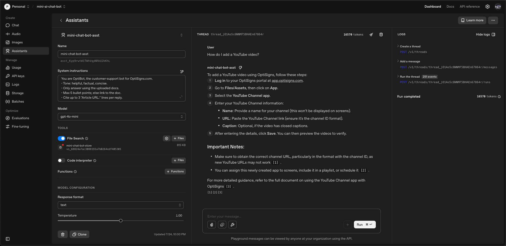

# Scrape Data For AI Chat Bot

## Setup

1. **Clone the repository:**

   ```bash
   git clone <repo-url>
   cd <repo-folder>
   ```

2. **Install dependencies:**

   Python version: **3.13.5**

   (on MacOS)

   ```bash
   pip3 install -r requirements.txt
   ```

   (on Windows)

   ```cmd
   pip install -r requirements.txt
   ```

3. **Set environment variables:**  
   Create a `.env` file and add the required variables, for example:

   ```
   OPENAI_API_KEY=your_openai_api_key
   BASE_URL=https://your-api-url.com
   VECTOR_STORE_ID=your_vector_store_id
   ```

   or use terminal:

   (on MacOS)

   ```bash
   cp .env.sample .env
   ```

   (on Windows)

   ```cmd
   copy .env.sample .env
   ```

---

## How to run locally

(on MacOS)

```bash
python3 main.py
```

(on Windows)

```cmd
python main.py
```

- The results will be saved in the `data/markdown/` folder.
- Logs are written to `logs/` folder.

---

## Daily Job Logs

> **Note:**  
> The scheduled job is **not implemented** because DigitalOcean requires a paid account for scheduled jobs.  
> You can run the script manually as shown above.

---

## Screenshot of Playground Answer

> 

---

## Notes

- Chunking Strategy: I leave it on default

  > By default, max_chunk_size_tokens is set to 800 and chunk_overlap_tokens is set to 400, meaning every file is indexed by being split up into 800-token chunks, with 400-token overlap between consecutive chunks.

  > [https://platform.openai.com/docs/assistants/tools/file-search#customizing-file-search-settings](https://platform.openai.com/docs/assistants/tools/file-search#customizing-file-search-settings)
